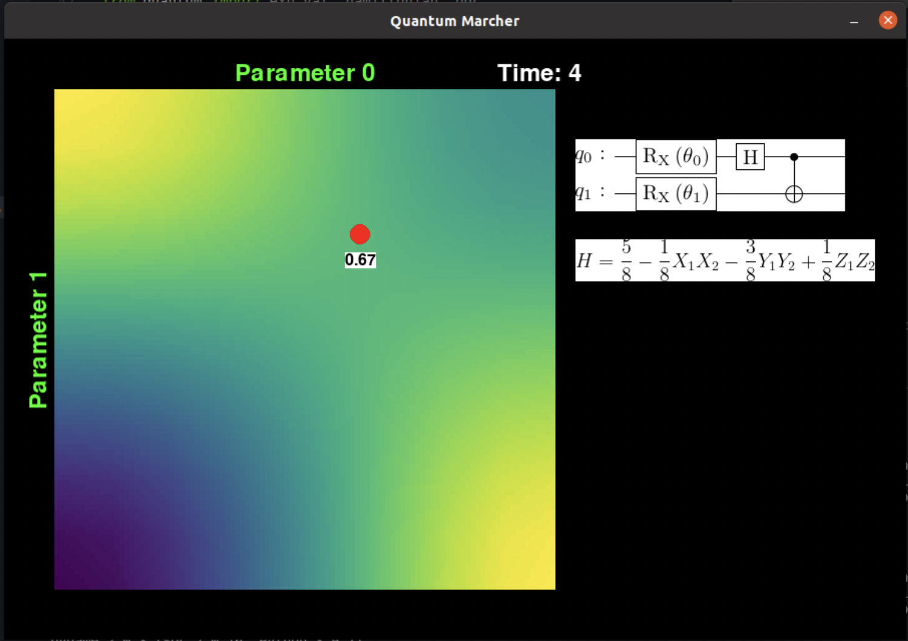
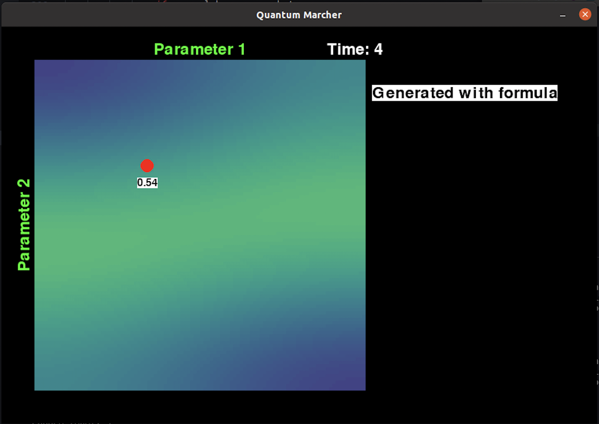

# Game Quantum Marcher

Adventurous way of learning about training variational circuits.
Challenge: march down the hill before the storm strikes. 

# Team Hike
Radoica Draskic, Jyoti Rani, Saad Mufti, Alice Liu, Emiliia Dyrenkova

# Concepts Players can Learn from Quantum Macrher

Variational quantum algorithms are a promising tool for near term quantum computers to achieve quantum advantage. By nature they are hybrid: partly quantum and partly classical. Quantum Macher is a game that essentially helps the user visualize the training of the variational circuit's parameters when gradient descent is used as the classical optimizer. 

Gradient descent is essentially the process of finding a local minimum. In our case however, the main difference is that the player can see the entire landscape instead of just the possible "steps" (or gradients) immediately around them. The purpose of this is to show the user how they can find a more direct path for a low number of parameters, but how doing so becomes increasingly difficult. Also, gradients are represented implicitly through color gradients between different regions of parameter space.

# How to Play 

Essentially, the player has to navigate a terrain (top down view) that ranges in height. Their goal is to get to the minimum height (0). If they run out of time, the game is over. While the beginning levels seem easy, finding the global maximum is quite challenging as the numbers of parameters increase.

Currently, player can choose between 3 different levels. Level 1 presents a landscape that was generated as an expectation value using an actual quantum circuit (shown on the right hand side of the screen) together with the corresponding Hamiltonian that was used. Levels 2 and 3 are analytic examples of possible landscapes for 3 and 4 parameters.

Player can move the red circle around the landscape using arrow keys. Game is over when the red circle reaches the lowest value of zero. In case when there are multiple parameters, player can press SPACE to change to another set of two random parameters that will be shown, or keys A and S to change one of the two parameters.

Your goal is to find the lowest value in each set of parameters. So for example 

## 

## Level 1

## Level 2

# Running the project

To install required packages run

`pip install -r requirements.txt`

Run the game using

`python ./QuantumMarcher/hike.py`

